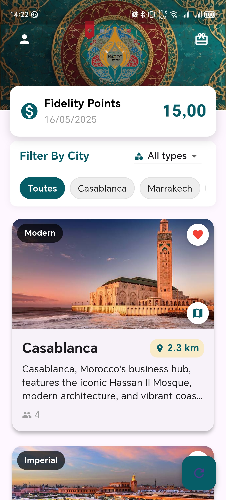

<a id="readme-top"></a>

<!-- PROJECT LOGO -->
<br />
<div align="center">
  <h3 align="center">Morocco 2030</h3>
  <p align="center">
    A comprehensive Flutter tourism application for discovering and exploring Moroccan cities, attractions, activities, and local experiences.
  </p>
</div>

<!-- TABLE OF CONTENTS -->
<details>
  <summary>Table of Contents</summary>
  <ol>
    <li>
      <a href="#about-the-project">About The Project</a>
      <ul>
        <li><a href="#built-with">Built With</a></li>
      </ul>
    </li>
    <li><a href="#architecture">Architecture</a></li>
    <li><a href="#screenshots">Screenshots</a></li>
    <li>
      <a href="#getting-started">Getting Started</a>
      <ul>
        <li><a href="#prerequisites">Prerequisites</a></li>
        <li><a href="#installation">Installation</a></li>
      </ul>
    </li>
    <li><a href="#contact">Contact</a></li>
  </ol>
</details>

<!-- ABOUT THE PROJECT -->

## About The Project

<a href="https://github.com/Hamza-Alali-0/Morocco2030">
    
</a>

Morocco 2030 is a comprehensive tourism and city exploration mobile application built with Flutter and Firebase. The platform enables users to discover Moroccan cities, monuments, restaurants, activities, and local experiences. Key features include:

- **City Discovery**: Browse and explore various Moroccan cities with detailed information and locations
- **Attractions & Monuments**: View historical sites, cultural landmarks, and tourist attractions
- **Activity Booking**: Discover and book local activities, tours, and experiences
- **Restaurant Guide**: Find and explore local dining options with detailed information
- **Transportation**: Access information about local transportation options
- **Fidelity Program**: Earn points through app engagement and referrals
- **User Profiles**: Manage personal information, preferences, and booking history
- **Geolocation**: Distance-based search and recommendations
- **Video Shorts**: Short-form video content showcasing attractions and experiences
- **Firebase Integration**: Real-time data with Cloud Firestore, Authentication, and Storage

### Built With

This project is built with the following technologies:

- [![Flutter][Flutter.com]][Flutter-url]
- [![Dart][Dart.com]][Dart-url]
- [![Firebase][Firebase.com]][Firebase-url]
- [![Google Maps][GoogleMaps.com]][GoogleMaps-url]
- [![Android][Android.com]][Android-url]
- [![iOS][iOS.com]][iOS-url]

<!-- Reference-style links for images -->

[Flutter.com]: https://img.shields.io/badge/Flutter-02569B?style=for-the-badge&logo=flutter&logoColor=white
[Flutter-url]: https://flutter.dev/
[Dart.com]: https://img.shields.io/badge/Dart-0175C2?style=for-the-badge&logo=dart&logoColor=white
[Dart-url]: https://dart.dev/
[Firebase.com]: https://img.shields.io/badge/Firebase-FFCA28?style=for-the-badge&logo=firebase&logoColor=black
[Firebase-url]: https://firebase.google.com/
[GoogleMaps.com]: https://img.shields.io/badge/Google%20Maps-4285F4?style=for-the-badge&logo=google-maps&logoColor=white
[GoogleMaps-url]: https://developers.google.com/maps
[Android.com]: https://img.shields.io/badge/Android-3DDC84?style=for-the-badge&logo=android&logoColor=white
[Android-url]: https://www.android.com/
[iOS.com]: https://img.shields.io/badge/iOS-000000?style=for-the-badge&logo=ios&logoColor=white
[iOS-url]: https://www.apple.com/ios/

<p align="right">(<a href="#readme-top">back to top</a>)</p>

<!-- ARCHITECTURE -->

## Architecture

The application is structured with the following key components:

- **Authentication**: Firebase Authentication with email/password and Google Sign-In
- **Database**: Cloud Firestore for real-time data storage and synchronization
- **Storage**: Firebase Storage for images and media files
- **UI Components**:
  - City exploration and filtering
  - Monument and attraction listings
  - Restaurant discovery
  - Activity booking system
  - Transportation information
  - Video shorts player
  - User profile management
  - Fidelity points system
- **Location Services**: Google Maps integration and geolocator for distance-based features
- **State Management**: StatefulWidget and SharedPreferences for persistent data

### Key Features by Module:

- `authentification/` — User signup, login, and authentication flows
- `city/` — City browsing, filtering, and detail views
- `monument/` — Historical sites and cultural landmarks
- `restaurant/` — Dining options and restaurant details
- `activity/` — Activities and experiences booking
- `transportation/` — Local transportation information
- `shorts/` — Short-form video content
- `profile/` — User profile and settings
- `Reservations/` — Booking management
- `support/` — Customer support features

<p align="right">(<a href="#readme-top">back to top</a>)</p>

<!-- SCREENSHOTS -->

## Screenshots

Here are some screenshots of the project:

| Home Screen        | City Details          | Activities                |
| ------------------ | --------------------- | ------------------------- |
| ![home][hotel-img] | ![detail][hotel2-img] | ![activities][hotel3-img] |

[hotel-img]: screens/restaurants.jpg
[hotel2-img]: screens/HOMEPAGE2.jpg
[hotel3-img]: screens/tendance.jpg

<p align="right">(<a href="#readme-top">back to top</a>)</p>

<!-- GETTING STARTED -->

## Getting Started

To run the project locally, follow these steps.

### Prerequisites

- Flutter SDK (3.7.2 or higher)
- Dart SDK (3.7.2 or higher)
- Android Studio / Xcode (for mobile development)
- Firebase account with a configured project
- Google Maps API key

### Installation

1. Clone the repository

```sh
git clone https://github.com/Hamza-Alali-0/Morocco2030.git
cd flutterappfinal/flutter_application_1
```

2. Install Flutter dependencies

```sh
flutter pub get
```

3. Configure Firebase:

   - Add your `google-services.json` (Android) to `android/app/`
   - Add your `GoogleService-Info.plist` (iOS) to `ios/Runner/`
   - Update `firebase_options.dart` with your Firebase configuration

4. Create a `.env` file in the project root with required API keys:

```env
GOOGLE_MAPS_API_KEY=your_google_maps_api_key
```

5. Run the application:

```sh
flutter run
```

Or build for specific platforms:

```sh
# Android
flutter build apk

# iOS
flutter build ios

# Web
flutter build web
```

### Firebase Configuration

Ensure your Firebase project has the following enabled:

- Authentication (Email/Password and Google Sign-In)
- Cloud Firestore
- Firebase Storage
- Required Firestore collections: `users`, `cities`, `monuments`, `restaurants`, `activities`

<a id="contact"></a>

## Contact

Hamza Alali - [hamza.alali.dev@gmail.com](mailto:hamza.alali.dev@gmail.com)

Connect with me:

- <a href="https://dev.to/@hamzaalali0" target="_blank"></a>
- <a href="https://www.linkedin.com/in/hamza--alali" target="_blank"></a>
- <a href="https://github.com/hamza-alali-0" target="_blank"></a>
- <a href="https://www.instagram.com/alalihamza.0/" target="_blank"></a>

Project Link: [https://github.com/Hamza-Alali-0/Morocco2030.git](https://github.com/Hamza-Alali-0/Morocco2030.git)

<p align="right">(<a href="#readme-top">back to top</a>)</p>
